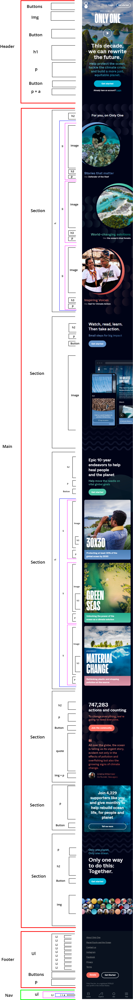

# Procesverslag
**Auteur:** Tim Meeuwsen

Markdown cheat cheet: [Hulp bij het schrijven van Markdown](https://github.com/adam-p/markdown-here/wiki/Markdown-Cheatsheet). Nb. de standaardstructuur en de spartaanse opmaak zijn helemaal prima. Het gaat om de inhoud van je procesverslag. Besteedt de tijd voor pracht en praal aan je website.

## Bronnenlijst
1. https://css-tricks.com/snippets/css/a-guide-to-flexbox/
2. https://css-tricks.com/snippets/css/complete-guide-grid/
3. https://developer.mozilla.org/en-US/docs/Web/CSS/linear-gradient()
4. https://css-tricks.com/a-few-background-patterns-sites/
5. https://developer.mozilla.org/en-US/docs/Web/Guide/HTML/Using_HTML_sections_and_outlines
6. https://developer.mozilla.org/en-US/docs/Web/CSS/CSS_Grid_Layout
7. https://stackoverflow.com/questions/2504071/how-do-i-combine-a-background-image-and-css3-gradient-on-the-same-element

## Eindgesprek (week 7/8)

Lastig vind ik dat je niet teveel code mag toevoegen maar code moet schijven die iedereen kan gebruiken. Flex box en grid was is het begin lastig te gebruiken maar nu ik dit goed begrijp ga ik dit vaker toevoegen in websites. Wat vooral goed ging is dat ik geen div heb gebruikt tijdens het maken van de website en voorheen dee ik dit altijd.

**Screenshot(s):**

-screenshot(s) van je eindresultaat-

## Voortgang 3 (week 6)

Deze week ging goed ik ben bijna klaar ik moet nog een aantal kleine aanpassingen maken zoals: meer wit ruimte tussen sections, laatste responsive punten en js verbeteren.

## Voortgang 2 (week 5)

De website heeft deze week niet veel aanpassingen gehad omdat ik een vak van vorig jaar moest herkansen maar ik heb wel de feedback die ik heb gekregen dat ik niet alleen sections moet gebruiken maar ook aricles toegevoegt. Ook heb de code netter gemaakt door gebruik van tabjes en notities.

## Voortgang 1 (week 3)

### Stand van zaken

Lastig verloop achter For you, on Only One maken. Sanne heeft dit uitijndelijk gemaakt en heb ik de kleuren aangepast en hoe groot het is.

Scrollbarr in de breete snap ik nog niet waarom die dat toont omdat alles binnen de 100vw breete zit en verdwijnt ook niet als ik overvlow hidden doe op de body of main.

  

Ik ben bijna klaar met de homepagina alleen nog wit ruimte en kleine aanpasingen.

### Agenda voor meeting

-samen met je groepje opstellen-

| Tugce          | Romi               | Yas-lin      | 
| ---            | ---                | ---          | 
| dit bespreken  | en dit             | en ik dit    | 
| an dat ook nog | dit als er tijd is | nog een punt |
| ...            | ...                | ...          | 

### Verslag van meeting

-na afloop snel uitkomsten vastleggen-

## Breakdownschets (week 1)

-uitwerken voor de 1e werkgroep - eind van de eerste week-

  

## Intake (week 1)
-uitwerken voor de kick-off werkgroep - begin van de eerste week-

**Je startniveau:** zwart

**Je focus:** responsive

**Je opdracht:** https://only.one/

**Screenshot(s) van de eerste pagina (small screen):**

   

**Screenshot(s) van de tweede pagina (small screen):**

